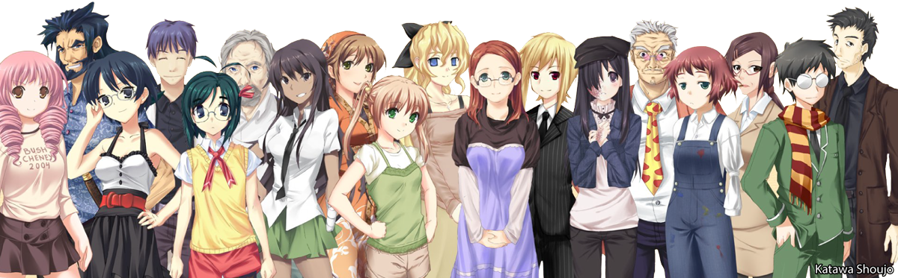

# FRANCE INTERACTIVE NOVELS

## Guide des visual novels et romans graphiques interactifs francophones

Cette page répertorie les visual novels et romans graphiques interactifs disponibles en Français. Il s'agit d'une liste non-exhaustive de titres sélectionnés vis-à-vis de leur qualité et de leur intérêt.

Ce site contient des captures extraites des différents visual novels énumérés. Celles-ci sont la propriété de leurs auteurs respectifs.

URL : [www.interactivenovels.fr](https://interactivenovels.fr)
site hébergé sur GitHub Pages

Code source : [github.com/realjck/franceinteractivenovels](https://github.com/realjck/franceinteractivenovels)

### Languages
* JavaScript / CSS3 / PHP 5 pour la partie backoffice

### Ressources
* Visuel de couverture : Katawa Shoujo
* jQuery 1.12.4
* Font Awesome Free 5.15.4
* showdown 1.9.1
* Bootstrap 3.3.7

### License
*Copyright (c)2022 realjck. L'autorisation est par la présente accordée, gratuitement, à toute personne obtenant une copie de ce logiciel et des fichiers de documentation associés (le «Logiciel»), pour traiter dans le Logiciel sans restriction, y compris sans limitation les droits pour utiliser, copier, modifier, fusionner, publier, distribuer, sous-licencier et / ou vendre copies du Logiciel, et pour permettre aux personnes à qui le Logiciel est fourni à cet effet, sous réserve des conditions suivantes: L'avis de droit d'auteur ci-dessus et cet avis d'autorisation doivent être inclus dans tous copies ou parties substantielles du logiciel. LE LOGICIEL EST FOURNI "EN L'ÉTAT", SANS GARANTIE D'AUCUNE SORTE, EXPRESSE OU IMPLICITE, Y COMPRIS MAIS SANS S'Y LIMITER LES GARANTIES DE QUALITÉ MARCHANDE, ADAPTATION À UN USAGE PARTICULIER ET NON-CONTREFAÇON. EN AUCUN CAS LE LES AUTEURS OU LES TITULAIRES DE COPYRIGHT SONT RESPONSABLES DE TOUTE RÉCLAMATION, DOMMAGES OU AUTRES RESPONSABILITÉ, QUE CE SOIT DANS UNE ACTION DE CONTRAT, DE TORT OU AUTRE, DÉCOULANT DE, HORS OU EN LIEN AVEC LE LOGICIEL OU L'UTILISATION OU D'AUTRES ACTIONS DANS LE LOGICIEL.*